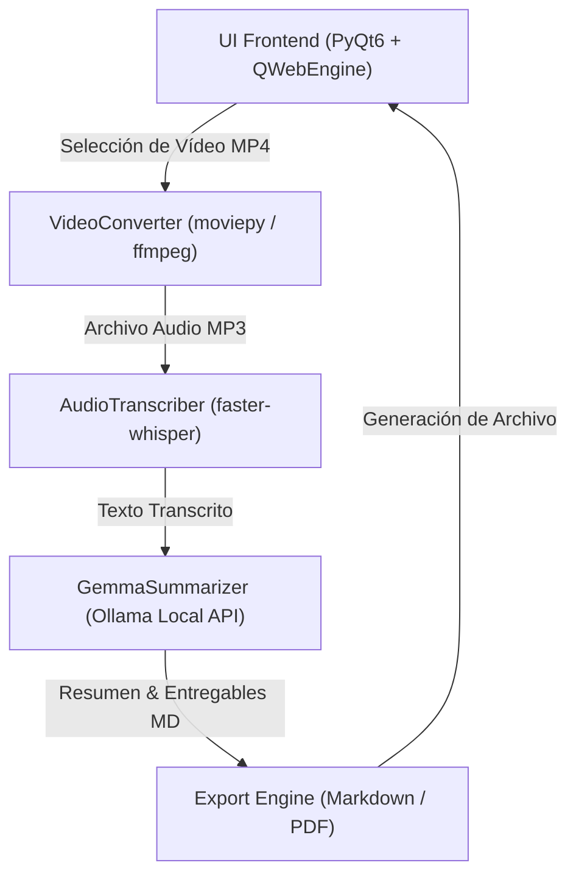

# Arquitectura del Sistema - esencIA

Este documento detalla la estructura lógica, los componentes principales y el flujo de datos de la aplicación **esencIA**.

---

## 🏗️ Vista General de Componentes

---

## 🧩 Descripción de Módulos

### 1. `src/version.py`
Contiene la fuente única de verdad para los metadatos de la aplicación (nombre, versión, identificador de Windows, autor y licencia).

### 2. `src/converter/video_converter.py`
Extrae el audio de archivos de vídeo MP4 y genera archivos de audio optimizados en formato MP3 con reporte de progreso mediante callbacks.

### 3. `src/transcriber/audio_transcriber.py`
Procesa el archivo MP3 mediante el motor CTranslate2 (`faster-whisper`), aplicando filtro VAD (*Voice Activity Detection*) para eliminar silencios y alucinaciones.

### 4. `src/summarizer/gemma_summarizer.py`
Se conecta a la API local compatible con OpenAI expuesta por Ollama. Aplica un prompt estructurado de alta fidelidad para extraer resúmenes académicos y detectar entregables (ensayos, tesis, fechas).

### 5. `src/ui/main_window.py`
Gestiona la ventana principal de la interfaz gráfica en PyQt6 con QWebEngine, asegurando respuestas asíncronas para mantener la fluidez de la interfaz.

---

## 🛠️ Herramientas y Empaquetado

- **`pyproject.toml`**: Configuración unificada para `pytest`, `ruff` y `black`.
- **`scripts/build_exe.ps1`**: Script de PowerShell para compilar la aplicación a través de PyInstaller y generar el paquete distribuible.
